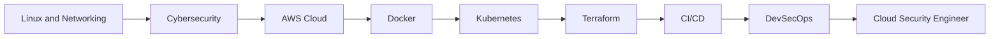

<div align="center">

# Hi, I'm Aung Moe Myint 👋

### Cybersecurity Student • Cloud & DevOps Engineer in Progress ☁️


<br>


</div>

---

## 👨‍💻 About Me

```yaml
name: Aung Moe Myint
location: Myanmar
education: 4th-Year Computer Science Student
major: Cybersecurity
university: University of Information Technology
current_focus:
  - AWS Cloud
  - DevOps
  - DevSecOps
  - Cybersecurity
  - Infrastructure Automation
career_goal: Cloud Security and DevSecOps Engineer
```

* 🎓 Studying **Computer Science with a Cybersecurity specialization** at UIT Myanmar
* ☁️ Exploring **AWS, Azure, Cloud Architecture and Cloud Security**
* 🚀 Building CI/CD pipelines and automated cloud infrastructure
* 🐳 Working with **Docker, Kubernetes, Terraform and Jenkins**
* 🔐 Interested in **Blue Team Operations, SOC, Network Security and CTFs**
* 🐧 Enjoy using Linux, Bash and Python for automation
* 🤖 Exploring **Machine Learning for Intrusion Detection Systems**
* 📚 Preparing for the **AWS Certified Solutions Architect – Associate**
* ⚡ Personal motto: **Automate it, deploy it, secure it**

---

## 🏆 Achievements

<div align="center">

| Achievement                                     |                    Result                   |
| :---------------------------------------------- | :-----------------------------------------: |
| 🥇 Myanmar Cyber Security Challenge 2025        |                 **Rank #4**                 |
| 🏅 Myanmar Cyber Security Challenge 2024        |                 **Rank #17**                |
| 🌏 Asia Pacific Youth Internet Governance Forum | **Selected Participant – APrIGF YIGF 2026** |
| 🚩 Capture The Flag Competitions                |            **Active CTF Player**            |
| ☁️ Cloud and DevOps Learning                    |           **Continuous Progress**           |

</div>

---

## 🌐 Connect With Me

<div align="center">

<a href="https://github.com/aungmoemyint007">
  
</a>

<a href="mailto:YOUR_EMAIL">
  
</a>

<a href="https://www.linkedin.com/in/YOUR_USERNAME">
  
</a>

<a href="https://facebook.com/YOUR_PROFILE">
  
</a>

</div>

---

# 💻 Technology Arsenal

## ☁️ Cloud Platforms

<p>
  
</p>

## 🚀 DevOps and Infrastructure

<p>
  
</p>

## 💻 Programming and Scripting

<p>
  
</p>

## 🗄️ Databases

<p>
  
</p>

## 🐧 Operating Systems and Tools

<p>
  
</p>

---

## 🛡️ Cybersecurity Interests

```text
🔹 Security Operations Center
🔹 Blue Team Operations
🔹 Network Traffic Analysis
🔹 Intrusion Detection Systems
🔹 Cloud Security
🔹 DevSecOps
🔹 Digital Forensics
🔹 Threat Detection
🔹 Capture The Flag
🔹 Security Automation
```

---

## 🚀 Current Learning Journey



---

# 📊 GitHub Analytics

<div align="center">


</div>

---

## 🔥 Contribution Streak

<div align="center">


</div>

---

## 🏆 GitHub Profile Trophies

<div align="center">


</div>

---

## 📈 Contribution Activity

<div align="center">


</div>

---

## 🐍 Contribution Snake

<div align="center">


</div>

---

## 💡 Developer Quote

<div align="center">


</div>

---

<div align="center">

### 🔐 Secure the code. Automate the workflow. Build the future.

**Keep Learning • Keep Building • Keep Securing**

<br>


</div>
